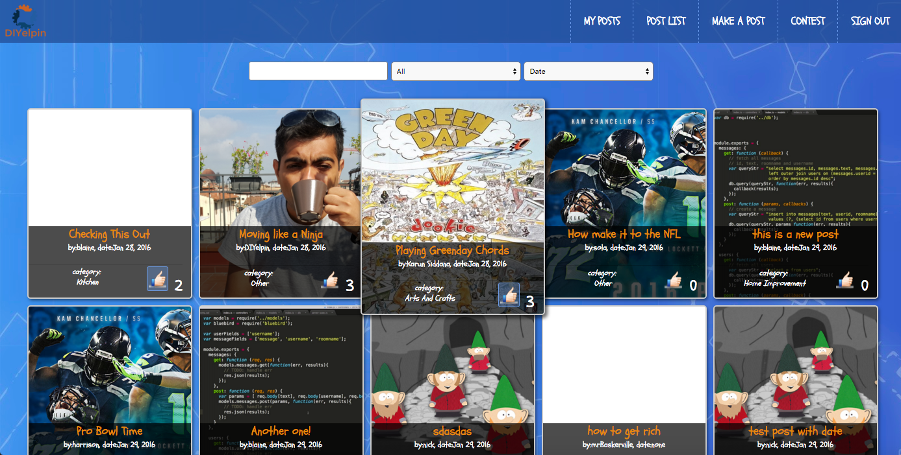
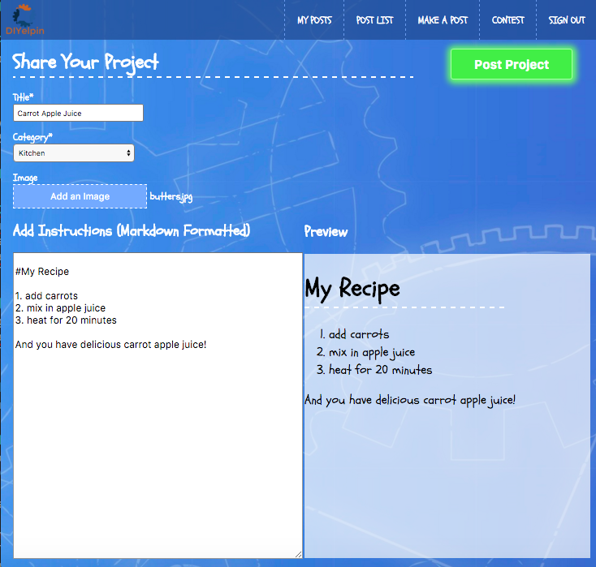
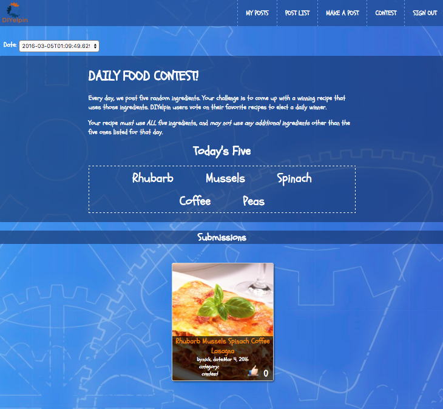

## Overview
DIYelpin-TURBO is a site where people can share their DIY projects with others.  Users view all posts submitted and can up-vote projects that they like.  There is a contest page where users can submit entries for a food contest that creates 5 random ingredients each day.

## Features

### View DIY-Posts
The main login page is a tiled list view of DIY projects that have been submitted.  Each post can be up-voted and there are filters to help users to search based on text and category.  The items on the page are also sortable by votes and date.

Below is a preview of the main page.

### Create a DIY-Post
Once logged in, users may create a post about any Do-It-Yourself project they would like to share.  The instructions for the project are Markdown formatted. A preview window shows how the markdown formatted text will be displayed (as shown below).

### Food Contest
If a user navigates to contest, users can participate in a food challenge involving 5 random ingredients for that day.  There is a drop down in the top left corner, so that past contests can be viewed.

## Technologies

This is a MEAN app.  Calling `npm install` from the root folder will install all required dependencies.

## Contributing
Contributors should upload changes to their fork and make a pull request!

## License
The MIT License (MIT)
Copyright (c) 2016 Breakaway-Bikers
Permission is hereby granted, free of charge, to any person obtaining a copy of this software and associated documentation
files (the "Software"), to deal in the Software without restriction, including without limitation the rights to use, copy, modify,
merge, publish, distribute, sublicense, and/or sell copies of the Software, and to permit persons to whom the Software is
furnished to do so, subject to the following conditions:
The above copyright notice and this permission notice shall be included in all copies or substantial portions of the Software.
THE SOFTWARE IS PROVIDED "AS IS", WITHOUT WARRANTY OF ANY KIND, EXPRESS OR IMPLIED, INCLUDING BUT
NOT LIMITED TO THE WARRANTIES OF MERCHANTABILITY, FITNESS FOR A PARTICULAR PURPOSE AND
NONINFRINGEMENT. IN NO EVENT SHALL THE AUTHORS OR COPYRIGHT HOLDERS BE LIABLE FOR ANY CLAIM,
DAMAGES OR OTHER LIABILITY, WHETHER IN AN ACTION OF CONTRACT, TORT OR OTHERWISE, ARISING FROM, OUT OF OR IN CONNECTION WITH THE SOFTWARE OR THE USE OR OTHER DEALINGS IN THE SOFTWARE.
